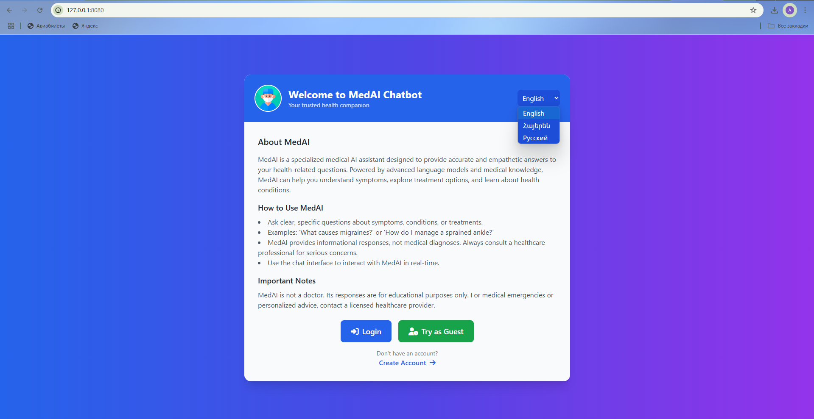
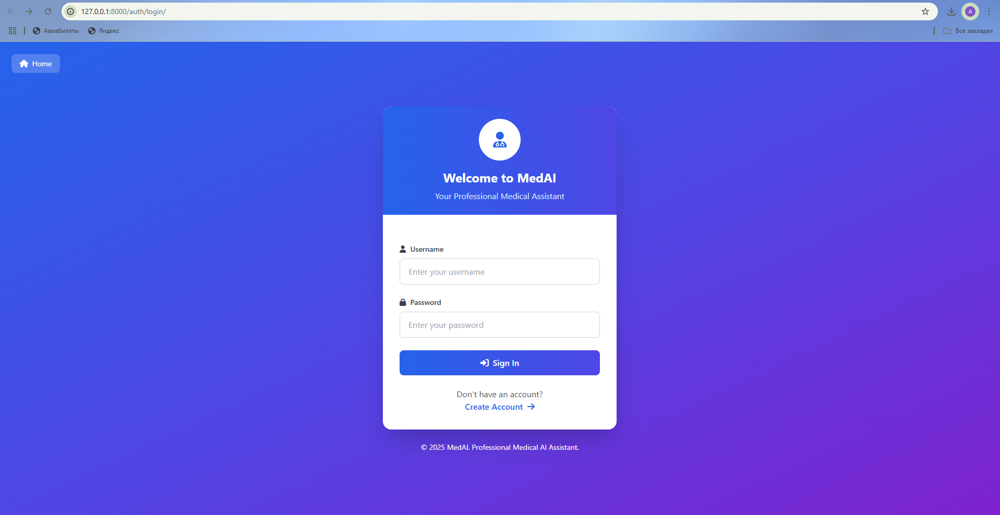
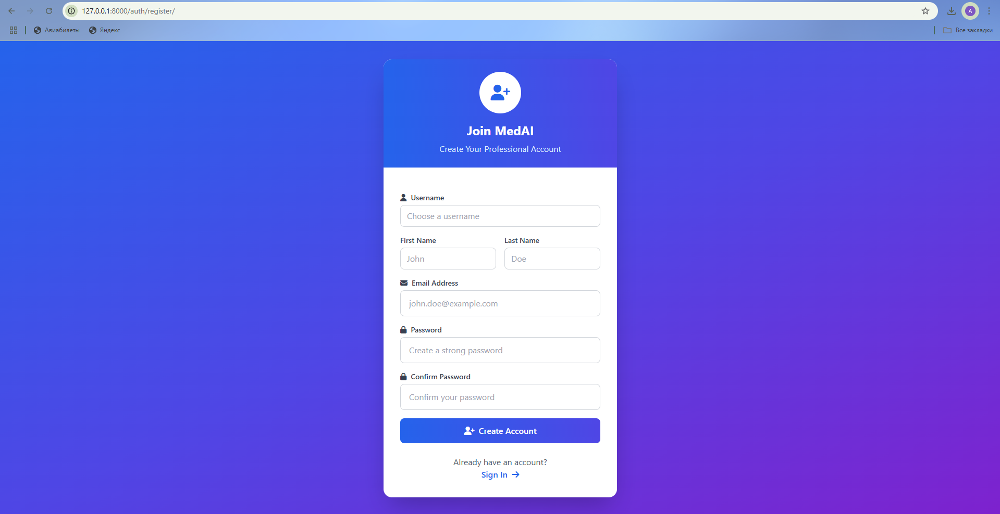
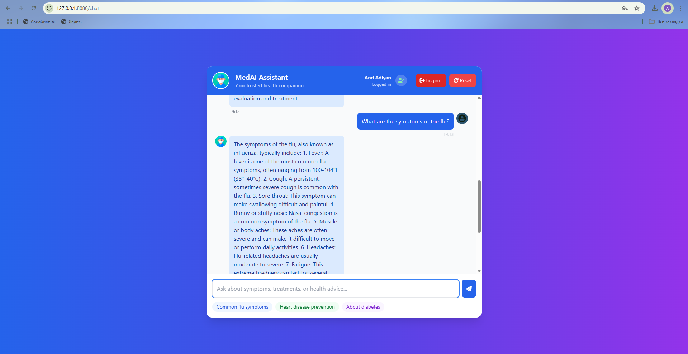

# MedAI-ChatBot

## Overview
MedAI is a web-based medical chatbot designed to provide accurate, context-aware responses to medical queries in English, Armenian, and Russian. It integrates a retrieval-augmented generation (RAG) pipeline to leverage medical PDF data, a user authentication system for personalized chat history, and a conversational AI model for natural responses.

## Screenshots
Below are key visuals of MedAI in action:


*Home page of the MedAI application.*


*Login interface.*


*Registration interface for new users.*


*Chatbot interface for medical queries.*

## Features
- **Multilingual Support**: Processes queries in English, Armenian, and Russian using `deep-translator` and `langid` for language detection and translation.
- **Retrieval-Augmented Generation (RAG)**: Retrieves relevant medical information from PDF documents stored in Pinecone, enhancing response accuracy.
- **User Authentication**: Django-based login/register system with PostgreSQL to store user profiles and chat history.
- **Conversational AI**: Powered by HuggingFace’s Inference API (`google/gemma-2-9b-it-fast`) for efficient, scalable response generation.
- **Performance Optimization**: Uses `cachetools` for response caching and `ThreadPoolExecutor` for parallel translation, ensuring fast responses.
- **Responsive UI**: Built with Flask, HTML, and Tailwind CSS for a modern, user-friendly interface.

## Setup Instructions
To run MedAI locally:

1. **Clone the Repository**:
   ```bash
   git clone https://github.com/AdiyanAndranik/medai-chatbot.git
   cd medai-chatbot
   ```

2. **Create a Virtual Environment**:
   ```bash
   python3 -m venv venv
   source venv/bin/activate  # Linux/Mac
   venv\Scripts\activate     # Windows
   ```

3. **Install Dependencies**:
   ```bash
   pip install -r requirements.txt
   ```  

4. **Set Up Environment Variables**:
   Create a `.env` file in the root directory:
   ```plaintext
   PINECONE_API_KEY=your-pinecone-api-key
   HUGGINGFACE_TOKEN=your-huggingface-token
   ```

5. **Run the Application**:
   ```bash
   python manage.py migrate
   python manage.py runserver
   python app.py
   ```
   - Access at `http://localhost:8080` for login/register.
   - Navigate to `http://localhost:8080/chat` for the chatbot.